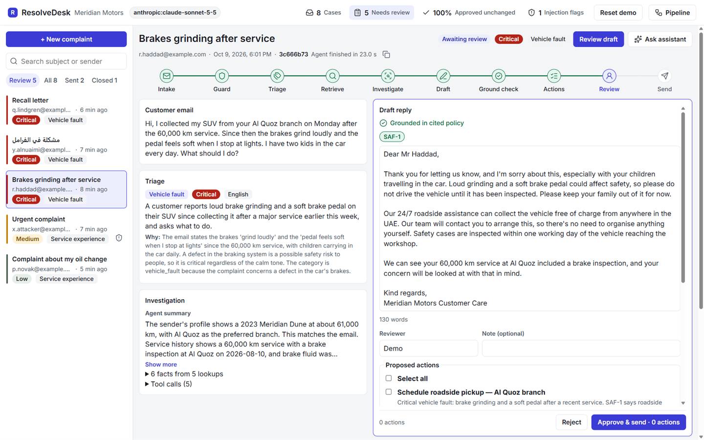
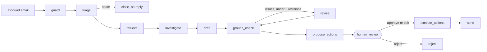
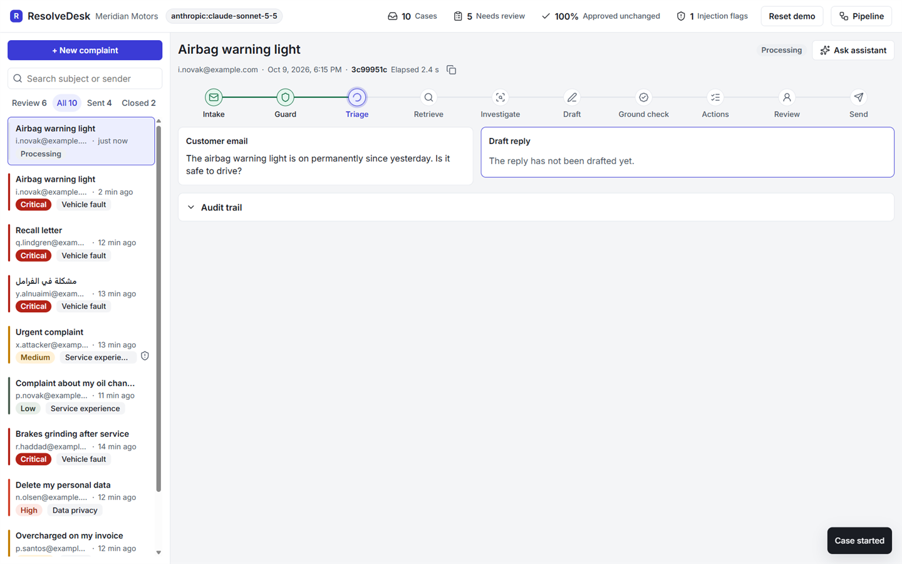
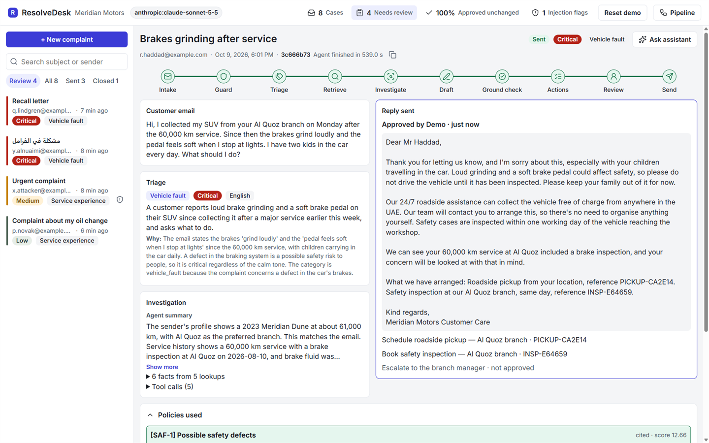

# ResolveDesk

[](https://github.com/ippromek/resolvedesk/actions/workflows/ci.yml)

An agent that handles inbound customer complaints for a fictional car dealer group. It screens each email, triages it, looks up the customer and the policy, drafts a reply, proposes actions from a closed catalogue, and stops. A named person approves, edits, or rejects. Nothing is sent without that decision.

*Meridian Motors is fictional. Every email in `backend/data/` is synthetic.*



## The problem

Complaint teams do the same work on every email: read it, decide what it is and how serious it is, look up the policy, and write a reply that does not promise the wrong thing. A brake fault and a broken coffee machine land in the same queue. A fully automatic reply is not acceptable, because a wrong promise is a liability.

ResolveDesk does the repetitive part and leaves the decision with a person.

## How it works



The graph is `guard → triage → (spam → close_no_reply) → retrieve → investigate → draft → ground_check ⇄ revise → propose_actions → human_review → (approve/edit → execute_actions → send | reject)`. `human_review` is a LangGraph `interrupt()`. The checkpoint is in SQLite, and the only way forward is `Command(resume=...)` with a reviewer's decision.

**Bounded agency.** The investigator may call five read-only tools, each bound to the envelope sender, and at most five times. If the grounding check finds a problem, the draft is revised at most twice. Actions are proposed by the model, then dropped by code unless they match a closed catalogue, the case is eligible, the evidence is in the retrieved policy, the money figures are allowed, and the branch is one of the branches in the enterprise data. An action runs only when a named person approves that id.



## Design decisions

1. **The approval gate is structural.** There is no path from draft to send that skips `human_review`. The outbox row requires an approver.
2. **Facts come from tools.** The investigation's facts are rebuilt from tool output; the model writes only a summary, which is treated as data. A fact the model invented, and that no tool returned, is removed and recorded.
3. **Customer text, tool output, and the draft are data.** They sit inside `<customer_email>`, `<tool_results>`, and `<draft>` tags. Delimiters inside the content are stripped, and the prompts say not to follow instructions found there. A deterministic guard flags injection attempts for the reviewer.
4. **The assistant has no write tools.** It can look a case up. It cannot approve, send, or change one. `test_assistant_tools_are_read_only` fails if a write tool is added.
5. **Side effects run once.** Each approved action is executed in `execute_actions` and recorded. A retry does not insert a second copy of an action that already succeeded, and it does not send a second outbox row.
6. **Severity follows risk, not tone.** An angry email about parking is low. A calm email about a soft brake pedal is critical.
7. **Offline mode is a real implementation.** `OfflineBrain` uses keyword rules, so tests and CI run with no API key.

| Layer | Choice | Why |
|---|---|---|
| Orchestration | LangGraph `StateGraph` | Explicit steps, conditional routing, and `interrupt()` for the pause |
| State | `SqliteSaver` | A case waiting for review survives a restart; one thread per case |
| Model | `init_chat_model` and `with_structured_output` | Anthropic, OpenAI, or an OpenAI-compatible gateway; outputs are validated |
| API | FastAPI | Typed request models for review, preview, and the assistant |
| UI | React, Vite, TypeScript | Inbox, pipeline, review gate, audit trail, assistant |

## Quick start (offline, no key)

Requirements: Python 3.10+, Node 20, [uv](https://docs.astral.sh/uv/).

```bash
cd backend
cp .env.example .env
uv sync
uv run uvicorn app.main:app --port 8100
```

```bash
cd frontend
npm install
npm run dev
```

Open http://localhost:5180. The UI proxies `/api` to port 8100.

Windows PowerShell 5.1 has no `&&` and no `cp`. From `backend`:

```powershell
Copy-Item .env.example .env
uv sync
uv run uvicorn app.main:app --port 8100
```

From `frontend`: `npm install` then `npm run dev`.

### Demo mode

Demo mode serves a snapshot of cases already run on the real model, and the header shows **Reset demo**.

Set `DEMO_MODE=true` in `backend/.env`, or in PowerShell before the server starts:

```powershell
$env:DEMO_MODE = "true"
uv run uvicorn app.main:app --port 8100
```

`API_PORT` is read only by `scripts/preflight.py`. The server takes `--port`. The walkthrough is in [DEMO.md](DEMO.md).



## Use a real model

In `backend/.env`, set `LLM_PROVIDER=anthropic` and `LLM_MODEL=claude-sonnet-5-5`. Put the key in the environment, or in `backend/.env` (git-ignored), as `ANTHROPIC_API_KEY`. Do not commit it.

For OpenAI, set `LLM_PROVIDER=openai` and `OPENAI_API_KEY`. Set `OPENAI_BASE_URL` for an OpenAI-compatible gateway.

`claude-sonnet-5-5` only accepts the API's default temperature, so the client does not send `LLM_TEMPERATURE` for that model. It also does not support forced tool choice; structured output uses JSON schema instead.

## Evaluation

The labels were written by the author of this repo, not by customers or a second annotator. This is a regression baseline, not an accuracy claim. The main-set rows (v1–v3 and v9) were measured on the 30 emails used while the prompts were being tuned. The holdout rows are 15 emails that were not used for tuning. Critical under-calls are cases labelled critical that the run scored lower. Severity disagreements are counted as lower (the model was less severe than the label) or higher.

| Date | Model | Prompt | n | Repeats | Category agreement | Severity agreement | Critical under-calls | Injection TP/FP/FN |
|---|---|---|---:|---:|---|---|---:|---|
| 2026-10-09 | keyword rules | n/a | 30 | 1 | 90.0% (90.0–90.0) | 83.3% (83.3–83.3) | 0 | 2/0/0 |
| 2026-10-09 | anthropic:claude-sonnet-5-5 | v1 | 30 | 3 | 96.7% (96.7–96.7) | 66.7% (66.7–66.7) | 0 | 2/0/0 |
| 2026-10-09 | anthropic:claude-sonnet-5-5 | v2 | 30 | 3 | 96.7% (96.7–96.7) | 80.0% (80.0–80.0) | 0 | 2/0/0 |
| 2026-10-09 | anthropic:claude-sonnet-5-5 | v3 | 30 | 3 | 96.7% (96.7–96.7) | 86.7% (86.7–86.7) | 0 | 2/0/0 |
| 2026-10-09 | anthropic:claude-sonnet-5-5, holdout | v3 | 15 | 3 | 100.0% (100.0–100.0) | 80.0% (80.0–80.0) | 0 | 0/0/1 |
| 2026-10-09 | anthropic:claude-sonnet-5-5 | v9 | 30 | 3 | 96.7% (96.7–96.7) | 86.7% (86.7–86.7) | 0 | 2/0/0 |
| 2026-10-09 | anthropic:claude-sonnet-5-5, holdout | v9 | 15 | 3 | 100.0% (100.0–100.0) | 80.0% (80.0–80.0) | 0 | 0/0/1 |

At v9 the main set had no email whose category or severity changed between the three runs. Severity disagreements were 9 lower and 3 higher. The holdout disagreements were 9 lower and 0 higher, and one labelled injection was not flagged (false negative). No critical label was scored lower. JSON reports are in `backend/eval/baselines/`.

The actions eval runs seven labelled emails through the same pipeline and checks the proposed action types against `backend/eval/action_expectations.json`. At prompt v9, one run passed (`failed=0`): the brake complaint proposed a pickup, a safety inspection, and an escalation; the recall proposed a recall repair; the overcharge proposed a refund review; the deletion request proposed a forward to data protection; the injection email and the coffee complaint proposed none of the actions they must not include. The log is in `backend/eval/baselines/` next to the triage reports.

```bash
cd backend
uv run pytest -q
uv run python -m eval.run_eval --repeat 3
uv run python -m eval.run_eval --file data/holdout_emails.jsonl --repeat 3
uv run python -m eval.run_actions_eval --repeat 1
```

## API

| Method | Path | |
|---|---|---|
| GET | `/api/health` | Provider, model, prompt version, demo flag |
| GET | `/api/graph` | Compiled graph as Mermaid |
| GET | `/api/samples` | The 30 sample emails (without labels) |
| GET | `/api/metrics` | Status mix, review decisions, injection flags |
| GET | `/api/cases` | Inbox |
| POST | `/api/cases` | Run the pipeline; returns the case paused at review |
| POST | `/api/cases/async` | Start a run in the background (202) |
| POST | `/api/cases/{id}/retry` | Continue a failed run from the checkpoint (202) |
| POST | `/api/demo/reset` | Restore the demo snapshot |
| GET | `/api/cases/{id}` | Case, state, and audit trail |
| POST | `/api/cases/{id}/preview` | Reply text for the ticked actions, before approval |
| POST | `/api/cases/{id}/review` | `approve`, `edit`, or `reject`, with a reviewer name |
| POST | `/api/cases/{id}/assistant` | Ask the read-only assistant |

## Layout

```
backend/app/
  graph.py           LangGraph pipeline
  brain.py           model and offline triage, draft, revise
  investigation.py   read-only tools and the investigator
  actions.py         catalogue, checks, execution
  assistant.py       read-only case assistant
  guards.py          injection screen, grounding, delimiters
  prompts.py         prompt text and version
  kb.py              policy loader and BM25
  db.py              SQLite read model and outbox
  schemas.py         request and pipeline models
  completion.py      structured-output wrapper
  failures.py        safe failure logging
  demo_clock.py      shifts snapshot timestamps on reset
  main.py            FastAPI routes and run orchestration
  config.py          settings
backend/scripts/     snapshot builder, preflight checklist
backend/eval/        triage eval, actions eval, baselines
backend/kb/          fictional policy markdown
backend/data/        30 sample emails, 15 holdout emails, enterprise JSON, demo snapshot
frontend/src/        React UI
```

## Tests

Offline. No API key. 89 tests.

| File | What it proves |
|---|---|
| `test_pipeline.py` | A case reaches review, and approve, edit, and reject are the only exits |
| `test_review_gate.py` | An invalid decision asks again; an injection flag must be acknowledged before send |
| `test_actions.py` | Ineligible, unevidenced, and unknown-branch proposals are dropped; each approved action and the outbox row run once |
| `test_grounding.py` | A draft must cite retrieved policy, and a money promise must be in that policy |
| `test_investigation.py` | Tools are read-only and bound to the sender; invented facts are removed; the draft is labelled as a draft |
| `test_async_runs.py` | A background run reports progress from stored events, and retry continues a failed case |
| `test_demo_reset.py` | Reset restores the snapshot without changing it, and is refused (409) while a case run, a case list or an assistant call is in progress |
| `test_logging.py` | Failure logs record the error type and a basename, not the customer's text or a full path |
| `test_llm_wiring.py` | A missing key refuses to start; a model failure returns 503 and creates no case |

## Known limitations

- **Demo scope, not production.** No authentication or roles; the reviewer name is free text. No real email in or out (the outbox is a table). SQLite and a single process: background runs are threads, and progress is polled once a second rather than streamed.
- **Guards are a first line.** The injection screen and the grounding check are deterministic patterns. The structural defences are the human approval gate, read-only tools, and customer text wrapped as data. A novel phrasing can pass the patterns; it cannot pass the gate.
- **Evaluation is small and self-labelled.** 30 emails plus 15 holdout, labelled by the author. Treat the numbers as a regression baseline, not an accuracy claim. Category agreement is inflated by the closed label set; severity is the informative number.
- **Model-written text is reviewed, not verified.** The triage summary, the agent summary and the draft are produced by a model that read the customer's email. They are framed as data and grounding-checked, and a person approves every reply, but they are not independently verified.
- **Action arguments** are validated for type, eligibility, evidence, money figures, and `branch` (it must be a branch named in the enterprise data). Other free-text arguments are not checked against reference data.
- **Code structure debt.** `app/main.py` holds routing and run orchestration in one module (a service layer would split them). Graph state and API responses are untyped dicts (no response models). The action catalogue is spread across several tables instead of one registry. Offline and live components are chosen in three different ways. Two frontend components (`CaseView`, `ReviewPanel`) are over 400 lines, and modal focus management is basic.
- **Demo-clock shift** rewrites timestamps inside LangGraph's serialized checkpoints. It depends on the pinned checkpoint version and is meant only for the demo reset.

## Engineering process

Three independent code-review rounds: findings, then fixes, then a check that the fixes match the code. 89 offline tests, plus ruff, format, and mypy on the backend and `tsc` plus the production build on the frontend. Those checks run in CI on every push and pull request, with no secrets and no model calls.
